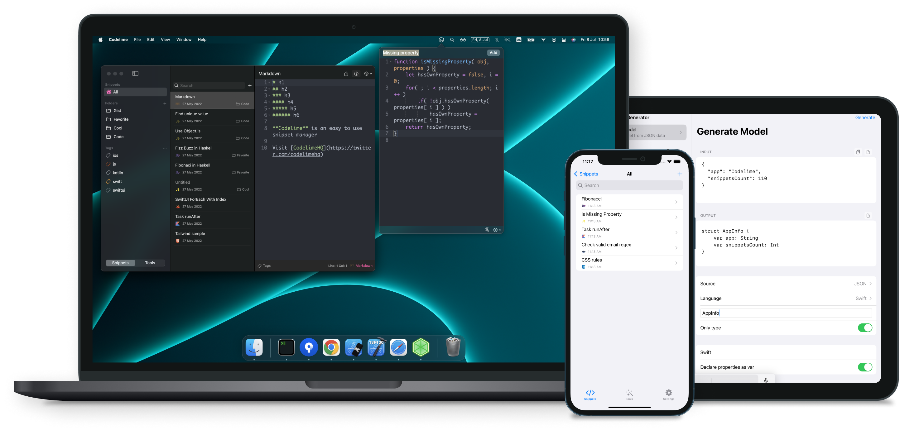

    <h2>Codelime - Snippet Dev Tools</h2>
    
Codelime is a powerful code snippet manager with many dev tools for iOS development.

    
    

  

    <!-- platform -->
    
    
    <!-- social -->
    

 

 

<h1>Features</h1>

- ✅ Native: Written in native AppKit and Swift to embrace the Mac experience. No Catalyst
- ✅ Universal: Universal purchase. Support Mac, iPhone and iPad apps. Sync with iCloud across all your devices
- ✅ Powerful code editor: Code editor with advanced editing settings
- ✅ No tracking: No analysis and data collecting. Your data remain locally and safe on your devices.
- ✅ Development tools: Boost your everyday development task

 

<h1>Code snippet</h1>

 

 

- Battle tested editor: Customize themes and languages
- Status menu bar: Create and save snippet conveniently from menu bar
- Folders and tags: Organize into folders and tags
- Quick search: Search snippets by name and content

 

<h1>Nifty iOS devevelopment toolset</h1>

 

 

- Base64: Encode and decode Base64
- Hash: Apply hash functions MD5, SHA1, SHA256, SHA384, SHA512
- URL: Encode and decode URL
- Text Case: Convert text cases upper, lower, snake, camel, title, constant, cobol, kebab, strikethrough, reverse
- Generate model: Generate model from JSON data
- JSON: Beautify and minify JSON
- Number Base: Convert number bases binary, octa, decimal, hexadecimal
- IP Lookup: Public IP Geolocation
- Format Text: Format text with programmable transformations
- Regex: Regular expression
- QR Code: Generate QR Code
- Date Time: Convert Unix timestamp
- Calculator: Perform Math expression
- Color Picker: Inspect color model and compare constrast ratio
- Text Styles: iOS and macOS text styles references
- JWT: Decode JSON Web Token
- Fonts: iOS Fonts reference
- Asset Catalog: Generate AppIcon.appiconset
- Screenshot: Make pretty code screenshot
- XML: Beautify and minify XML

 

<h1>Convenient iPhone app</h1>
Still powerful but crafted exclusively for mobile experience

 

 

 

 

<h1>Support</h1>

- Have a problem? Please open a GitHub issue
- Visit homepage https://indiegoodies.com/codelime/ for more information

Codelime is done by a 2 persons indie development team and your support helps keep the project going. Thanks for checking out and have a nice day 😇
